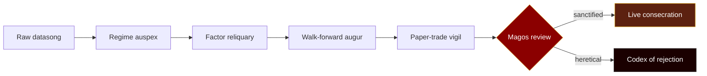

<!-- ============================================================
     ++ CODEX ALGORITHMICUS · MAGOS ShellPayant ++
     Sanctified by the Omnissiah. Forged in the silicon altars.
     ============================================================ -->

<!-- ============= HEADER (sanctified red/gold wave) ============= -->
<a href="https://github.com/ShellPayant">
  
</a>

<!-- ============= BINHARIC INVOCATION ============= -->
<div align="center">
  <a href="https://github.com/ShellPayant">
    
  </a>
</div>

<!-- ============= TOP SIGILS ============= -->
<div align="center">
  
  <a href="https://github.com/ShellPayant?tab=followers"></a>
  
</div>

<br/>

<!-- ============= AUGUR LOG ============= -->
## ⚙&nbsp; AUGUR LOG

```
>> Cogitator online. Auspex scanning. The Omnissiah is pleased.

   designation :  Magos Algorithmus, Adept Tertius
   order       :  Adeptus Algorithmicus
   forge_world :  AlphaFactory · Sigma Sector
   discipline  :  Systematic equity research · data-rite
   doctrine    :  Process before result · risk before signal
   canticle    :  "The market is the Omnissiah's will, expressed in floats."
   forbidden   :  Auto-traded daemons · over-engineered tabernacles · vibes
   fueled_by   :  Sacred caffeine · the steady hum of cogitators

>> END LOG.
```


<!-- ============= THE FORGE ============= -->
## ☩&nbsp; THE FORGE

### `AlphaFactory` &nbsp;·&nbsp; *Sigma-Class Research Engine*

A sacred apparatus for the discovery of **fresh edges** in the holy markets of US equity. Not a strategy — a **search ritual**, performed nightly by sanctified workflows, judged by the steady hand of a Magos.



**Engine:** Nautilus Trader &nbsp;·&nbsp; **Datasong:** Polars + DuckDB + Parquet  
**Validation rites:** Walk-forward · purged k-fold · deflated Sharpe  
**Sanctification gate:** Mandatory. *The Machine assists. The Magos decides.*

> *"By the grace of the Omnissiah, the codex shall be revealed — one signal at a time."*


<!-- ============= MODE CUISINE (FR · toggleable) ============= -->
<div align="center">

<details>
<summary><b>&nbsp;🥄&nbsp; Bonus FR : ouvrir si vous voulez me voir <i>cook</i>&nbsp;</b></summary>

<br/>

<div align="left">

> *Bon. Vous voulez vraiment savoir comment je travaille ? Asseyez-vous.*

Moi je suis pas un quant comme les autres. Moi je suis un **cuisinier franco-allemand exilé en Irlande**, et le marché c'est ma cuisine. Je m'en fous des slides. Je m'en fous des LinkedIn posts. Donnez-moi un terminal, un dataset propre, et **laissez-moi cook**.

Le tick-data, c'est mes oignons : tu les caramélises lentement, tu déglaces au volume bid-ask, tu réduis. La **régime detection** ? Une *réduction de jus de momentum* — tu laisses mijoter trois ans de S&P jusqu'à ce que ça nappe la cuillère. Le **risk sizing** c'est le sel : trop t'es mort, pas assez c'est fade — *et personne, jamais, n'a aimé un Sharpe fade*.

**AlphaFactory** c'est pas un restaurant. C'est une **brigade**. Le sous-chef regime envoie les tickets, le commis factor scanner épluche l'univers, et moi en passe je goûte tout au paper trading avant que ça parte en salle. *Si c'est pas bon ça repart au feu. Si c'est trop salé on jette.* Pas de pitié. La cuisine c'est de la rigueur, pas du vibes.

Les gens me disent *« mais tu peux pas juste utiliser un LSTM comme tout le monde ? »* — **non**. Le LSTM c'est le micro-ondes du quant. Ça réchauffe mais ça cuit rien. Moi je fais à l'ancienne : **GARCH au beurre noisette**, **isolation forest en croûte de sel**, **random forest petit, comme un macaron** — pas un gâteau de mariage de 14 couches qui s'effondre au premier régime change.

Et la sauce, **toujours**, c'est la **walk-forward**. Réduite. Déglacée au purged k-fold. Montée au monte-carlo. Si elle tranche, ta stratégie tranche aussi. Pas de raccourci.

L'IA ? L'IA c'est mon plongeur. Elle nettoie, elle prépare, elle fait la mise en place. *Mais elle touche pas au capital.* Jamais. Le jour où ton plongeur sort un plat tout seul, ton restaurant ferme.

*Voilà. Maintenant fermez la porte de la cuisine et laissez-moi bosser.*

— ShellPayant, chef de partie · *Brigade AlphaFactory*

</div>

</details>

</div>

<br/>

<!-- ============= SANCTIONED AUGMETICS ============= -->
## ⚙&nbsp; SANCTIONED AUGMETICS

<div align="center">

| Choir | Sacred Tools |
|:---|:---|
| **Litanies** |     |
| **Data-rites** |     |
| **Augury** |     |
| **Cogitator-forge** |     |
| **Sanctum** |    |

</div>


<!-- ============= CODEX OF NUMBERS ============= -->
## ☩&nbsp; CODEX OF NUMBERS

<div align="center">


<br/>


<br/>


</div>

<br/>

<!-- ============= COGITATOR'S PROCESSION (snake) ============= -->
<div align="center">
  <picture>
    <source media="(prefers-color-scheme: dark)" srcset="https://raw.githubusercontent.com/ShellPayant/ShellPayant/output/github-snake-dark.svg"/>
    <source media="(prefers-color-scheme: light)" srcset="https://raw.githubusercontent.com/ShellPayant/ShellPayant/output/github-snake.svg"/>
    
  </picture>
</div>


<!-- ============= SACRED CANTICLE ============= -->
<div align="center">
  
</div>

<!-- ============= TRANSMIT VOX ============= -->
## ⚙&nbsp; TRANSMIT VOX

<div align="center">

<a href="https://github.com/ShellPayant"></a>
<a href="https://github.com/ShellPayant?tab=repositories"></a>


</div>

<br/>

<!-- ============= FOOTER (toll the bell) ============= -->


<div align="center">
  <sub><i>Forged by sanctified hand · Documented in binharic verse · Reviewed by the Magos</i></sub>
</div>
