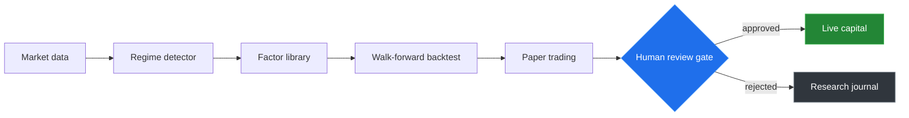

<!-- ============= HEADER (animated gradient wave) ============= -->
<a href="https://github.com/ShellPayant">
  
</a>

<!-- ============= TYPING SVG ============= -->
<div align="center">
  <a href="https://github.com/ShellPayant">
    
  </a>
</div>

<!-- ============= TOP BADGES ============= -->
<div align="center">
  
  <a href="https://github.com/ShellPayant?tab=followers"></a>
  
</div>

<br/>

<!-- ============= ABOUT ============= -->
## &nbsp;About

I design and build systems where rigor matters more than speed of shipping. My core focus is **systematic trading infrastructure** — but finance is one domain, not the only one. Data tooling, decision-support systems, and reproducible research pipelines are all fair game.

```yaml
name:        ShellPayant
role:        Solutions developer · quant first, not quant only
focus:       Systematic trading · data tooling · reproducible research
location:    Anywhere with low latency · UTC+1
currently:   Building AlphaFactory — research → paper → execution lab
philosophy:  Process before result · Risk before entry · Regime before signal
not_a_fan:   Auto-traded black boxes · over-engineered abstractions · vibes
fueled_by:   Espresso · curiosity · the occasional drawdown
```


<!-- ============= AlphaFactory FLAGSHIP ============= -->
## &nbsp;What I'm building

### `AlphaFactory` &nbsp;·&nbsp; *systematic equity research lab*

A modular platform for hunting **recent** edges in US equities. Not a strategy — a **search system** that runs nightly, scores candidates, and surfaces decisions for human review.



**Engine:** Nautilus Trader &nbsp;·&nbsp; **Data:** Polars + DuckDB + Parquet  
**Validation:** Walk-forward, purged k-fold, deflated Sharpe  
**Human gate:** Mandatory. AI assists, AI does not allocate capital.

> Components publish to GitHub as they reach the publishable bar. Pinned repos update in lockstep.


<!-- ============= TECH STACK ============= -->
## &nbsp;Stack

<div align="center">

| Layer | Tools |
|:---|:---|
| **Languages** |     |
| **Data** |     |
| **Quant** |     |
| **Infra** |     |
| **Workflow** |    |

</div>


<!-- ============= GITHUB STATS ============= -->
## &nbsp;By the numbers

<div align="center">


<br/>


<br/>


</div>

<br/>

<div align="center">
  
</div>

<br/>

<!-- ============= SNAKE ANIMATION ============= -->
<div align="center">
  <picture>
    <source media="(prefers-color-scheme: dark)" srcset="https://raw.githubusercontent.com/ShellPayant/ShellPayant/output/github-snake-dark.svg"/>
    <source media="(prefers-color-scheme: light)" srcset="https://raw.githubusercontent.com/ShellPayant/ShellPayant/output/github-snake.svg"/>
    
  </picture>
</div>


<!-- ============= QUOTE ============= -->
<div align="center">
  
</div>

<!-- ============= CONTACT ============= -->
## &nbsp;Get in touch

<div align="center">

<a href="mailto:maxbobbi974@gmail.com"></a>
<a href="https://github.com/ShellPayant"></a>

</div>

<br/>

<!-- ============= FOOTER ============= -->


<div align="center">
  <sub><i>Built quietly · Documented openly · Reviewed weekly</i></sub>
</div>
