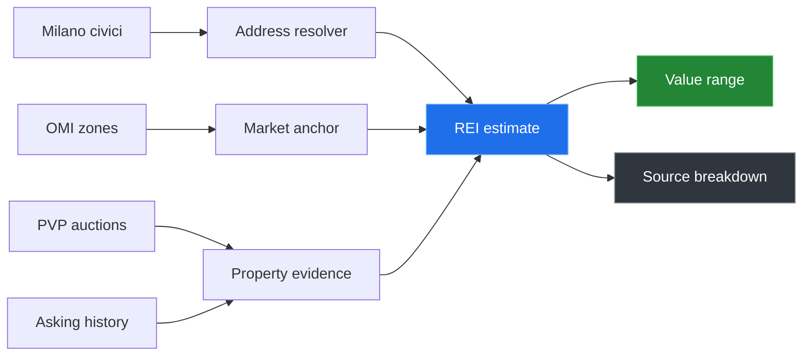

<!-- ============= HEADER ============= -->
<a href="https://github.com/ShellPayant">
  
</a>

<!-- ============= TYPING SVG ============= -->
<div align="center">
  <a href="https://github.com/ShellPayant">
    
  </a>
</div>

<!-- ============= TOP BADGES ============= -->
<div align="center">
  
  <a href="https://github.com/ShellPayant?tab=followers"></a>
  
</div>

<br/>

<!-- ============= ABOUT ============= -->
## &nbsp;About

I build data products where messy public records need to become something useful. My current focus is **REI Milano**: a Milan property-intelligence project that combines official real-estate data, civic address data, auction records, and market evidence into practical property estimates.

```yaml
role:        Data product builder · real-estate systems · applied research
focus:       REI Milano · Italian property data · public-source valuation tooling
location:    Europe-facing work · Milan market focus
currently:   Building a Milan estimator with OMI, civici, PVP auctions, and asking history
philosophy:  Source context before confidence · ranges before false precision
not_a_fan:   Black-box valuations · stale market assumptions · undocumented datasets
fueled_by:   Espresso · maps · clean pipelines · stubborn source validation
```


<!-- ============= REI MILANO FLAGSHIP ============= -->
## &nbsp;What I'm building

### `REI Milano` &nbsp;·&nbsp; *property intelligence for Milan*

<div align="center">


<p>


</p>

</div>

REI Milano estimates apartment values in Milan from public and official data. The goal is not to pretend the Italian market has perfect transparency. The goal is to make the available signals usable: OMI micro-zones, Milan civic addresses, PVP auction records, asking-price history, and a clear uncertainty range.



**Current pilot:** Milan  
**Core sources:** Agenzia Entrate OMI, Comune di Milano civici, PVP auctions, Wayback captures  
**Live market layer:** an operator terminal aggregating ECB rates, Italian RE-sector equities, short-let (Airbnb) pressure, and real-estate news — context only, it never moves the estimate  
**Output:** property estimate, 80% range, and explainable source context  
**Demo modes:** FastAPI backend and static browser demo

> The public repo is [`rei-data-engine`](https://github.com/ShellPayant/rei-data-engine): the pipeline, API, validation work, and demo behind REI Milano.


<!-- ============= REI DATA ============= -->
## &nbsp;Milano data spine

<div align="center">

| Layer | What it contributes |
|:---|:---|
| **OMI zones** | Registered-transaction EUR/m² ranges by micro-zone |
| **Milano civici** | Address resolution, coordinates, and neighborhood context |
| **PVP auctions** | Real auction outcomes and perizia-derived property evidence |
| **Asking history** | Open-market listing signals over time |
| **Static demo bundle** | Browser-side REI Milano estimate flow for easy sharing |
| **Money & markets** | ECB rates (Euribor · BTP-10Y · €STR · HICP) + Italian RE-sector equities — affordability & sentiment |
| **Short-let** | Inside Airbnb → per-zone density, entire-home share, implied STR yield |
| **Live feed** | Italian RE/economy news rail + an engine event-tape (new lots, price cuts, macro prints) |

</div>

The estimate is designed to show uncertainty directly. Italian public data has gaps, so REI Milano presents a range and the evidence behind it instead of a single overconfident number.


<!-- ============= TECH STACK ============= -->
## &nbsp;Stack

<div align="center">

| Layer | Tools |
|:---|:---|
| **Languages** |    |
| **Data** |     |
| **Backend** |    |
| **Geo / web** |    |
| **Workflow** |    |

</div>


<!-- ============= FEATURED WORK ============= -->
## &nbsp;Featured work

<div align="center">

| Project | Focus |
|:---|:---|
| [`rei-data-engine`](https://github.com/ShellPayant/rei-data-engine) | Milan property estimate pipeline, API, and static demo |
| `docs/` static demo | Browser-side REI Milano estimate flow for GitHub Pages / Netlify |
| PVP + OMI validation work | Auction-label checks and public-source estimate calibration |
| `REI Terminal` (Mercato) | Live Milano market console — rates, RE equities, short-let, news + event feed |

</div>


<!-- ============= GITHUB STATS ============= -->
## &nbsp;By the numbers

<div align="center">


<br/>


<br/>


</div>

<br/>

<!-- ============= SNAKE ANIMATION ============= -->
<div align="center">
  <picture>
    <source media="(prefers-color-scheme: dark)" srcset="https://raw.githubusercontent.com/ShellPayant/ShellPayant/output/github-snake-dark.svg"/>
    <source media="(prefers-color-scheme: light)" srcset="https://raw.githubusercontent.com/ShellPayant/ShellPayant/output/github-snake.svg"/>
    
  </picture>
</div>


<!-- ============= CONTACT ============= -->
## &nbsp;Get in touch

<div align="center">

<a href="https://github.com/ShellPayant"></a>
<a href="https://github.com/ShellPayant?tab=repositories"></a>


</div>

<br/>

<!-- ============= FOOTER ============= -->


<div align="center">
  <sub><i>Built quietly · sourced carefully · revised often</i></sub>
</div>
